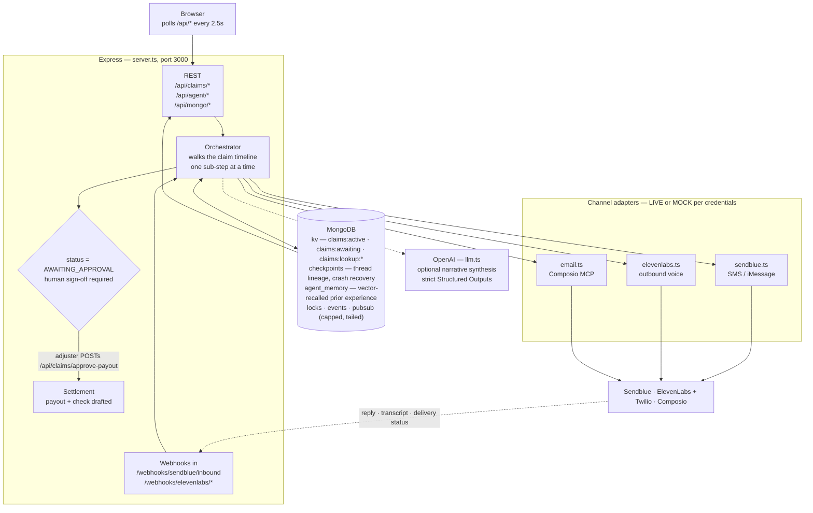

# Conquer

A **long-horizon insurance claim agent that does not cold-start.** Open a claim and the agent drives it end to end over days or weeks — texting and calling the policyholder and vendors, keeping state and memory in MongoDB, and stopping for a human adjuster's sign-off before any money moves.

MongoDB holds three separate things, and the distinction is the point:

| Collection | What it is | What it buys |
| --- | --- | --- |
| `kv` | live claim state, awaiting contact, channel reverse index | the current run |
| `checkpoints` | one document per transition, `thread_id`/`checkpoint_id`/`parent_checkpoint_id` | a restart mid-claim **resumes** instead of restarting, and any earlier transition is restorable |
| `agent_memory` | what earlier claims actually taught it, retrieved by Atlas Vector Search | a new claim opens knowing the concession this shop already agreed to, and the negotiation starts from that number |

`claim.workingMemory` is not memory in that sense — it is scoped to one claim and dies with it. `agent_memory` outlives the claim, the session, and the process.

It is not a chatbot and not a wizard you click through. The agent sends a message, then waits — sometimes for days. An inbound reply is what wakes it up and moves the claim forward.

**It runs with zero configuration.** With an empty `.env`, an ephemeral local `mongod` boots itself and every channel runs in MOCK mode: sends are logged instead of dispatched, so nothing leaves your machine. Add credentials per channel to go live.

## Quick start

```bash
npm install
npm run dev             # http://localhost:3000
```

**That is the whole setup.** No `.env`, no MongoDB to install, no tunnel, no accounts.
An ephemeral `mongod` boots itself (downloaded once), and every channel runs in MOCK —
sends are logged instead of dispatched. A claim runs end to end and settles.

Don't blindly `cp .env.example .env`; read what you uncomment. Two things worth
knowing before you scale up from local:

- **The default MongoDB is ephemeral** — a real `mongod`, but it dies with the process, so
  it defeats the three things this app is built around at once: a claim surviving a restart,
  checkpoint recovery, and memory carried between claims. Set `MONGODB_URI` (Atlas works)
  when you want any of that to hold. It is also a standalone instance, so no change streams,
  no transactions, and no Vector Search — recall drops to keyword mode and logs that it did.
- **Webhooks are inert locally.** Inbound replies arrive as webhooks and vendors cannot
  reach `localhost`, so nothing calls them until you expose a tunnel. Locally the agent
  is driven by the **Force Advance** button.

The header shows a LIVE/MOCK pill per channel (SMS, call, email, OpenAI). If they all say MOCK, nothing can leave the machine — no message, and no claim text to the model. That is the default and the safe state.

## Commands

- `npm run dev` — start dev server (`tsx server.ts`, Vite middleware, HMR on)
- `npm run build` — build client (`vite build`) + bundle server (`esbuild` → `dist/server.cjs`)
- `npm run start` — run built server (`node dist/server.cjs`), requires `npm run build` first
- `npm run lint` — type-check (`tsc --noEmit`)
- `npm run clean` — remove `dist/` and `server.js`

## Architecture



**How a claim actually moves.** The orchestrator takes the current sub-step. Internal sub-steps (`horizon`/`api`/`tool`/`outcome`) resolve immediately and it keeps going. Contact sub-steps (SMS, phone, email) fire the outbound send, mark themselves `awaiting_reply`, write a `claims:lookup:{channel}:{value}` reverse index, and stop. When the vendor POSTs the reply back to a webhook, that lookup resolves it to the waiting claim and progression resumes.

**The approval gate is real.** The final settlement never auto-fires. The claim parks in `AWAITING_APPROVAL` until an adjuster hits `POST /api/claims/approve-payout`.

**MongoDB is the memory, not a cache.** Claim state, what the agent is waiting on, the reverse index, a mutex serializing mutations, a seen-event set for webhook dedupe, the checkpoint lineage, and long-term agent memory all live there. With no `MONGODB_URI` in development the app boots an ephemeral `mongod` for you — convenient, but **everything is gone when the process exits.**

**Memory recall has two modes and never pretends otherwise.** On Atlas with an OpenAI key, `$vectorSearch` over an auto-provisioned index serves recall. Anywhere else — local mongod, MOCK_MODE, or an index still building — it falls back to deterministic keyword scoring. Same function, same result shape, and every recalled memory carries the mode that served it, so the log and the dashboard show which one you actually got.

**Restarting is the demo.** Kill the process mid-claim and start it again: `recoverOnBoot()` reads the newest unfinished checkpoint, puts the claim back in `claims:active`, and reinstates the awaiting contact and its reverse index — so an inbound reply that arrives after the restart still resolves. It deliberately re-sends nothing; re-dialling a policyholder on every deploy would be the worst possible failure mode. (Needs `MONGODB_URI`: with the ephemeral instance the database died with the process.)

There is also a live MongoDB dashboard in the UI (documents, TTLs, locks, command log, pub/sub feed, and a CLI that speaks both a key/value vocabulary and `COLLECTIONS`/`COUNT`/`FIND`) — useful for watching the agent think, and for querying *into* the stored claim: `FIND kv {"value.status":"AWAITING_APPROVAL"}`.

`POST /api/claims/process-step` still exists, but it is now a **force-advance override** for demos and testing — skip the wait and push the claim forward. It is not the normal path.

## Real channel testing

**The default posture is MOCK, and it should stay that way until you mean it.** A live channel sends a real text or dials a real phone.

To take a channel live:

1. **Add that channel's credentials to `.env`.** A channel goes live only when *all* of its variables are set — three for Sendblue, three for ElevenLabs, two for Composio email. See `.env.example` for what each one is. `MOCK_MODE=true` overrides all of them and forces mock, so no message, call or email can leave the machine.
2. **Point the demo at yourself.** Set `DEMO_CLAIMANT_PHONE` / `DEMO_CLAIMANT_EMAIL` to your own handset and inbox.
3. **Expose the server publicly.** Inbound replies arrive as webhooks, and vendors cannot reach `localhost`. Run any HTTP tunnel (ngrok, Cloudflare Tunnel, `ssh -R`, or your own reverse proxy) to `localhost:3000` and note the HTTPS URL it gives you.
4. **Register that URL in each vendor's dashboard** as the webhook target — `…/webhooks/sendblue/inbound` for Sendblue, the `…/webhooks/elevenlabs/*` routes for ElevenLabs. **This step is what actually wires inbound up.** There is a `PUBLIC_WEBHOOK_BASE` slot in `.env.example` to record the URL, but no code reads it, so setting it alone does nothing.
5. **Set `ELEVENLABS_WEBHOOK_SECRET`.** Without it the server accepts every webhook unverified and warns on each one. Don't run live that way.

Then confirm the header pill for that channel reads LIVE before you expect anything to arrive.

Two things that look like bugs but aren't:

- **Sendblue's free tier forbids cold outbound** — the recipient must have texted your Sendblue number *first*, or the send is rejected. Text the number from the demo handset before starting a live SMS demo.
- **If a reply never comes, the claim just waits.** There is no retry or reminder scheduler. Force-advance it when you're done waiting.

## Security

- **Never commit `.env`.** It is gitignored; only `.env.example` (which holds no values) is tracked.
- **Rotate any credential that has been pasted into a chat, an issue, or a terminal transcript.** Assume it is burned.
- Call recording is off unless you explicitly set `ELEVENLABS_RECORD_CALLS=true` — these are calls with real people.
- **`MOCK_MODE=true` covers the model as well as the channels.** It stops outbound messages, calls and emails *and* prevents claim text (names, loss descriptions, amounts) from being sent to OpenAI. It takes effect even if a model client was already created earlier in the process.

## Notes

- **Platform:** `node_modules` contains native binaries (esbuild). Never copy it between machines or OSes — run a fresh `npm install` per machine. If `npm install` warns about pending postinstall scripts, run `npm approve-scripts --allow-scripts-pending`.
- **`DISABLE_HMR=true`** makes `vite.config.ts` disable HMR and file watching. This is intentional — the AI Studio environment sets it to prevent flickering during agent-driven edits. Don't remove it.
- No test suite; `npm run lint` is type-checking only.

See `CLAUDE.md` for the internals: the MongoDB collection layout, the two different kinds of "lock", memory vs. checkpoints, adapter contracts, and the idempotency invariants.
