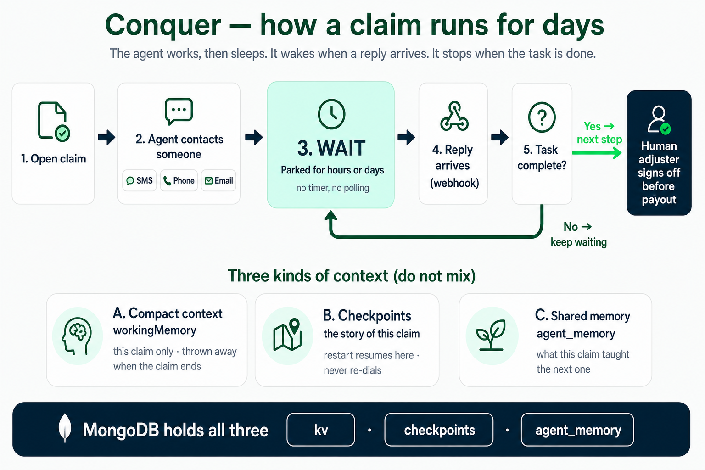
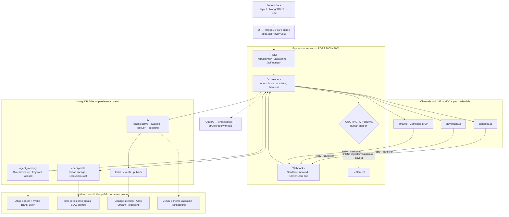

# Conquer

A **long-horizon insurance claim agent that does not cold-start.** Open a claim and the agent drives it end to end over days or weeks — texting and calling the policyholder and vendors, keeping state and memory in MongoDB, and stopping for a human adjuster's sign-off before any money moves.

**Live demo:** [https://web-production-96d85.up.railway.app](https://web-production-96d85.up.railway.app)



MongoDB holds **state, lineage, and memory** as three different things. Conflating them is how a long-horizon agent cold-starts.

| Collection | What it is | What it buys |
| --- | --- | --- |
| `kv` | live claim, awaiting contact, reverse index, session snapshots | where this run is *right now* |
| `checkpoints` | one document per transition (`threadId` / `checkpointId` / `parentCheckpointId`) | a restart **resumes**; any earlier beat is restorable |
| `agent_memory` | what earlier claims actually taught it, recalled by Atlas Vector Search | the next claim opens already knowing the concession / hold / dispute that worked |
| `locks` · `events` · `pubsub` | mutexes, webhook dedupe, capped tailable feed | concurrency and “the agent is thinking” dashboard |

`claim.workingMemory` is not memory in that sense — it dies with the claim. `agent_memory` outlives the claim, the session, and the process.

It is not a chatbot and not a wizard you click through. The agent sends a message, then waits — sometimes for days. An inbound reply is what wakes it up and moves the claim forward.

**It runs with zero configuration.** With an empty `.env`, an ephemeral local `mongod` boots itself and every channel runs in MOCK mode: sends are logged instead of dispatched, so nothing leaves your machine. Add credentials per channel to go live.

## Quick start

```bash
npm install
npm run dev             # http://localhost:3000 (or PORT=3001 npm run dev)
```

**That is the whole setup.** No `.env`, no MongoDB to install, no tunnel, no accounts.
An ephemeral `mongod` boots itself (downloaded once), and every channel runs in MOCK —
sends are logged instead of dispatched. A claim runs end to end and settles.

Don't blindly `cp .env.example .env`; read what you uncomment. Two things worth
knowing before you scale up from local:

- **The default MongoDB is ephemeral** — a real `mongod`, but it dies with the process, so
  it defeats the three things this app is built around at once: a claim surviving a restart,
  checkpoint recovery, and memory carried between claims. Set `MONGODB_URI` (Atlas works)
  when you want any of that to hold. It is also a standalone instance, so no change streams,
  no transactions, and no Vector Search — recall drops to keyword mode and logs that it did.
- **Webhooks are inert locally.** Inbound replies arrive as webhooks and vendors cannot
  reach `localhost`, so nothing calls them until you expose a tunnel. Locally the agent
  is driven by the **Force Advance** button.

The **bottom dock** (Comfort / Wide / Stretch, MongoDB CLI, Reset) is how you drive the demo. Channel LIVE/MOCK pills live with the claim chrome, not in a top header. If every channel is MOCK, nothing can leave the machine — no message, and no claim text to the model. That is the default and the safe state.

## Commands

- `npm run dev` — start dev server (`tsx server.ts`, Vite middleware, HMR on)
- `npm run build` — build client (`vite build`) + bundle server (`esbuild` → `dist/server.cjs`)
- `npm run start` — run built server (`node dist/server.cjs`), requires `npm run build` first
- `npm run lint` — type-check (`tsc --noEmit`)
- `npm run clean` — remove `dist/` and `server.js`

## Architecture

One Express process. MongoDB is not a cache behind it — it *is* the agent's working memory, crash log, and prior experience.



**How a claim actually moves.** The orchestrator takes the current sub-step. Internal steps (`horizon` / `api` / `tool` / `outcome`) resolve immediately. Contact steps (SMS, phone, email) fire the outbound send, mark `awaiting_reply`, write `claims:lookup:{channel}:{value}`, and **stop**. The vendor webhook is what wakes it. There is no polling loop and no timer driving the timeline.

**The approval gate is real.** Settlement never auto-fires. The claim parks in `AWAITING_APPROVAL` until `POST /api/claims/approve-payout`.

**Restarting is the demo.** Kill the process mid-claim and start it again: `recoverOnBoot()` reads the newest unfinished checkpoint, restores `claims:active`, and reinstates the awaiting lookup so a late webhook still resolves. It re-sends nothing. Needs `MONGODB_URI` — the ephemeral local `mongod` dies with the process.

**Memory recall never pretends.** On Atlas with an embedding key, `$vectorSearch` over an auto-provisioned index serves `agent_memory`. Anywhere else (local mongod, `MOCK_MODE`, index still building) it falls back to keyword scoring. Every recalled memory carries the mode that served it.

The MongoDB page in the dock is a live window into that: documents, TTLs, locks, pub/sub, command log, and a CLI (`COLLECTIONS` / `COUNT` / `FIND kv {"value.status":"AWAITING_APPROVAL"}`).

`POST /api/claims/process-step` is a **force-advance override** for demos. It is not the normal path.

### Why this shape (document model)

Access pattern: the agent almost always needs **the whole case at once** (timeline, holds, awaiting contact, working notes). That is embed, not join — one `Claim` document in `kv`, not a claims table plus a steps table plus a messages table. Checkpoints and memories are referenced out because they grow without bound and are queried on a different axis (thread history, “what worked on a similar shop”).

That is the MongoDB schema-design rule this app already follows: **data accessed together is stored together**; unbounded history is not stuffed into the live document (16MB hard limit, and a restart should not replay a megabyte of chat to find `status`).

### What else MongoDB can add here

These are the Atlas features that map onto *this* agent, not a generic MongoDB laundry list. Shipped vs next:

| Capability | Status | Why it belongs on this app |
| --- | --- | --- |
| Document `kv` + TTL + mutex + webhook dedupe | **Shipped** | Live state, exact expiry on `claims:lookup:*`, crash-safe locks |
| Checkpoints (document versioning / thread lineage) | **Shipped** | Resume after deploy; rewind a bad beat |
| Vector Search on `agent_memory` | **Shipped** (Atlas) | Next claim does not cold-start |
| Keyword fallback | **Shipped** | Local/ephemeral mongod still demos recall, honestly |
| **Atlas Search (lexical)** on memories + case notes | Add | Diagnosis: “toll hold” vs “smog” is a keyword problem, not a vibe problem. Fuzzy / phrase / autocomplete over `text`, `counterparty`, timeline `chatLog`. Do **not** use `$regex` / `$text` for this. |
| **Hybrid search (`$rankFusion`)** | Add (MongoDB 8.0+) | “Find the *Apex Auto* concession” (lexical) fused with “similar body-shop disputes” (vector). Needs a second `search`-type index beside the existing vector index. `$scoreFusion` if you want score math (8.2+). |
| **JSON Schema validation** on `kv` | Add | The dashboard CLI can write garbage into `claims:active`. Validation is the last line of defense (`id` + `timeline[]` required) so a bad `SET` becomes a 500, not a wedged claim. |
| **Multi-document transactions** | Add (Atlas replica set) | `persistClaim` currently writes claim + checkpoint + lookup as separate ops. A crash between them is how a thread wedges. One transaction = one beat. |
| **Change streams** | Add (Atlas) | Today `pubsub` is a capped collection because standalone mongod has no change streams. On Atlas, watch `kv` / `checkpoints` and drive the dashboard + watchdog off the replica set, not a tail loop. |
| **Time series `case_beats`** | Add | Watchdog / SLA: append-only `{ meta: {claimId, kind}, ts, stallDays, channel }`. Silence detection is a time-range query, not a scan of the live claim. 10–100× cheaper than a regular collection of events. |
| **Computed pattern on the claim** | Add | Precompute `daysOpen`, `stallDays`, `holdsOutstanding` on each persist so the UI and the voice brief do not re-walk the timeline. |
| **Archive pattern** | Add | Settled claims leave `kv` (`claims:active`) and land in `claims_archive`. Keeps the hot working set tiny; history still queryable. |
| **GridFS (or binary fields) for uploads** | Add | Smog cert / FNOL photos / estimate PDFs. Keep a short extended reference on the claim (`{fileId, filename, verifiedAt}`), blob out of the 16MB document. |
| **Atlas Stream Processing** | Add when MCP Atlas creds exist | The 6-day DMV-style silence: `$source` on checkpoint/webhook events → window on “no inbound” → `$emit` an escalate beat. Watchdog becomes a processor, not a cron in Node. Needs Atlas Stream Processing workspace (not a local mongod). |
| **MongoDB MCP Server** | Add in Cursor | Live `collection-schema` / `explain` / Atlas Search index create from the agent. Skills are installed; `npx mongodb-mcp-server@1 setup` still needs your Atlas URI or API keys. |

**What not to add:** a third database, a separate vector store, Redis-as-the-real-state-again, or splitting claims into many collections that then `$lookup` every request (unnecessary collections / excessive lookups). MongoDB is the platform this hackathon is about — keep the extra capabilities *on* it.

**Demo line for judges.** Three MongoDB primitives, three agent beats:

1. **Diagnosis** — query the document the portal does not show (`FIND` into nested `value`, later Atlas Search).
2. **Advocacy** — checkpoints + lookups: the agent keeps the dispute open across days; a restart does not drop it.
3. **Proactive risk** — `agent_memory` + computed deadlines: the agent remembers the second hold the citizen forgot.

The long-running payoff is one stall you can point at in the MongoDB dock, not three overlapping plots.

See `CLAUDE.md` for internals: the two kinds of lock, adapter contracts, strict Structured Outputs, and idempotency.

## Real channel testing

**The default posture is MOCK, and it should stay that way until you mean it.** A live channel sends a real text or dials a real phone.

To take a channel live:

1. **Add that channel's credentials to `.env`.** A channel goes live only when *all* of its variables are set — three for Sendblue, three for ElevenLabs, two for Composio email. See `.env.example` for what each one is. `MOCK_MODE=true` overrides all of them and forces mock, so no message, call or email can leave the machine.
2. **Point the demo at yourself.** Set `DEMO_CLAIMANT_PHONE` / `DEMO_CLAIMANT_EMAIL` to your own handset and inbox.
3. **Expose the server publicly.** Inbound replies arrive as webhooks, and vendors cannot reach `localhost`. Run any HTTP tunnel (ngrok, Cloudflare Tunnel, `ssh -R`, or your own reverse proxy) to `localhost:3000` and note the HTTPS URL it gives you.
4. **Register that URL in each vendor's dashboard** as the webhook target — `…/webhooks/sendblue/inbound` for Sendblue, the `…/webhooks/elevenlabs/*` routes for ElevenLabs. **This step is what actually wires inbound up.** There is a `PUBLIC_WEBHOOK_BASE` slot in `.env.example` to record the URL, but no code reads it, so setting it alone does nothing.
5. **Set `ELEVENLABS_WEBHOOK_SECRET`.** Without it the server accepts every webhook unverified and warns on each one. Don't run live that way.

Then confirm that channel's LIVE/MOCK pill reads LIVE before you expect anything to arrive.

Two things that look like bugs but aren't:

- **Sendblue's free tier forbids cold outbound** — the recipient must have texted your Sendblue number *first*, or the send is rejected. Text the number from the demo handset before starting a live SMS demo.
- **If a reply never comes, the claim just waits.** There is no retry or reminder scheduler. Force-advance it when you're done waiting.

## Security

- **Never commit `.env`.** It is gitignored; only `.env.example` (which holds no values) is tracked.
- **Rotate any credential that has been pasted into a chat, an issue, or a terminal transcript.** Assume it is burned.
- Call recording is off unless you explicitly set `ELEVENLABS_RECORD_CALLS=true` — these are calls with real people.
- **`MOCK_MODE=true` covers the model as well as the channels.** It stops outbound messages, calls and emails *and* prevents claim text (names, loss descriptions, amounts) from being sent to OpenAI. It takes effect even if a model client was already created earlier in the process.

## Notes

- **Platform:** `node_modules` contains native binaries (esbuild). Never copy it between machines or OSes — run a fresh `npm install` per machine. If `npm install` warns about pending postinstall scripts, run `npm approve-scripts --allow-scripts-pending`.
- **`DISABLE_HMR=true`** makes `vite.config.ts` disable HMR and file watching. This is intentional — the AI Studio environment sets it to prevent flickering during agent-driven edits. Don't remove it.
- No test suite; `npm run lint` is type-checking only.
